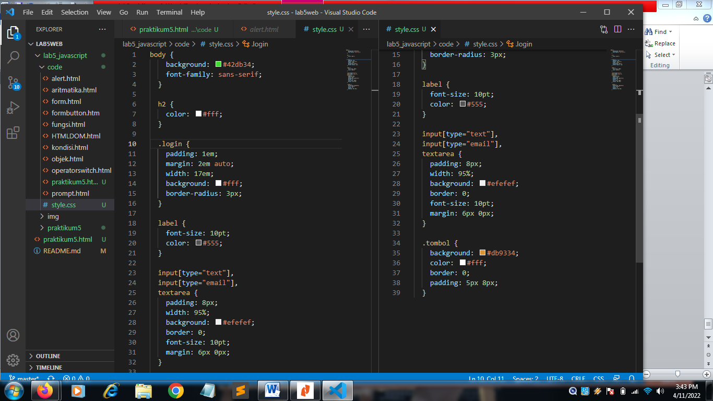

| Nama      | Nuryadi |
| ----------- | ----------- |
| NIM     | 312010621       |
| Kelas   | TI.20.A.1        |

## Langkah langkah praktikum 5
Persiapan membuat dokumen HTML dengan nama file lab5_javascript.html seperti berikut.

disini saya menggunakan visual stusio code

## 1. Javascript Dasar
Pemakaian Alert sebagai property window

Pemakaian method dalam objek

Pemakaian Prompt

Pembuatan fungsi dan cara pemanggilannya

## 2. Dasar Pemrograman Di Javascript
Operasi dasar aritmatika

Seleksi kondisi (if..else)

Penggunaan operator switch untuk seleksi kondisi

## 3. pembuatan Form
Form input

saya coba input nilai 8

Form button

## 4. HTML DOM
Pilihan menggunakan checkBox dengan perhitungan otomatis

## Pertanyaan dan Tugas
1. Buat script untuk melakukan validasi pada isian form

## Jawab

Membuat validasi nama lengkap, email, dan alamat

# form wajib diisi lengkap
form validasi yang saya buat harus diisi dengan lengkap dan benar dan jika tidak diisi dengan lengkap maka akan muncul peringatan "Anda harus mengisi data dengan lengkap!"
# berikut kode htmlnya :

Tambahkan juga css agar tampilan lebih menarik

Lalu lihat hasilnya pada browser

lihat juga apa yang terjadi jika data tidak diisi dengan lengkap

# keterangan
disini kita menjalankan fungsi validasi saat form di submit atau saat klik daftar
yang mana fungsi validasi sudah di buat untuk cek inputan. dan setiap isian data harus diisi dengan lengkap sehingga hasilnya benar dan apa bila tidak diisi akan terjadi peringatan untuk mengisi data dengan lengkap.

# lab5web
